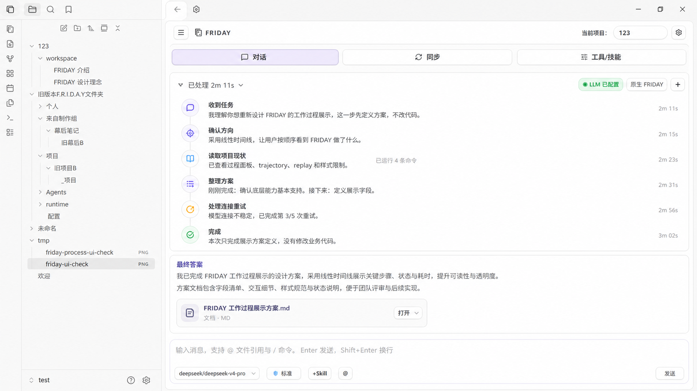

# FRIDAY Agent Process Timeline UI Implementation Plan

> **For Claude:** REQUIRED SUB-SKILL: Use superpowers:executing-plans to implement this plan task-by-task.

**Goal:** 将 FRIDAY 工作过程下拉区重做为接近预览图的线性时间线体验，让用户按顺序理解 FRIDAY 收到了什么、做了什么、刚刚完成什么、接下来做什么，以及最终结果是什么。

**Architecture:** 不改 agent kernel、trajectory 事实源或 replay 语义。新增/重塑 presentation view model，将现有 `AgentTrajectorySnapshot` 映射为面向用户的 `AgentProcessTimelineView`，再用新的 timeline renderer 和 CSS 还原预览图。现有 UI 只能提供数据来源和迁移参考，不能成为交互、布局、宽度、文案或 DOM 结构的上限。

**Tech Stack:** TypeScript, Obsidian DOM APIs, `AgentTrajectorySnapshot`, `DailyBoardView`, `agentProcessPanelViewModel.ts`, `agentTrajectoryRenderer.ts`, `styles.css`, Node test runner, DOM fake tests, CSS regression tests.

---

## Reference Preview

本计划以这张预览图为视觉与交互目标：



源文件备份位置：

```text
C:\Users\Keith\.codex\generated_images\019df77e-0609-75a2-823a-31093697fdeb\ig_09a34075c878638c0169fa133b8e5c8191bbe845b63c12ae25.png
```

预览图是视觉目标，不是要把图片嵌入插件 UI。实现必须用真实 DOM/CSS 渲染，不允许用截图、canvas 静态图、硬编码假内容来替代。

## Non-Negotiable Direction

这次不是在当前工作过程 UI 上做小修。目标是从体验出发重建过程展示：

- 下拉区是 Codex 风格的线性过程流，不是内部日志、工具列表或卡片堆叠。
- 主对话区展示最终答案；过程下拉区展示工作过程；文件卡片展示结果产物。三者边界必须清楚。
- live 和 completed 必须使用同一套 timeline 数据结构；完成后只改变时态、标题和默认收起状态，不能换一套内容。
- 技术细节默认折叠。用户第一眼看到的是语义动作，不是 `Model step`、`Context: skills`、`Listed 4 item(s)`、status code 或 trace。
- 前端必须尽可能还原预览图的视觉关系：浅色 Obsidian 环境、右侧 FRIDAY 面板、线性 timeline、最终答案区、文件 artifact card、宽屏自适应。
- 不得因为当前 `visibleSteps`、旧 CSS、旧折叠逻辑、`640px/720px` 限宽或旧 DOM 容器存在，就牺牲目标交互。

## Product Experience

用户完成一次任务时，应看到三个层级：

```text
FRIDAY conversation
  process disclosure
    header: 已处理 2m 11s / 正在处理 18s
    timeline:
      收到任务
      确认方向
      读取项目现状
      整理方案
      处理连接重试
      完成
  final answer
    最终答案正文
  result artifacts
    文件卡片、打开按钮、diff 摘要
```

过程下拉区回答的问题：

- FRIDAY 是否收到了任务？
- FRIDAY 如何理解任务边界？
- FRIDAY 按顺序做了哪些关键动作？
- 刚刚完成了什么？
- 接下来准备做什么？
- 是否遇到连接、工具、审批、文件修改问题？
- 是否需要用户确认、重试、批准或打开文件？

最终答案区回答的问题：

- 本次结论是什么？
- 方案、代码、文档或检查结果是什么？
- 用户下一步应该看什么或决定什么？

文件产物区回答的问题：

- 本次新增或修改了哪些具体文件？
- 文件是什么类型？
- 能否直接打开？

## Visual Target

### Overall Layout

目标 UI 应接近预览图：

- 左侧仍是 Obsidian 文件/导航区域；右侧是 FRIDAY 插件主体。
- FRIDAY 主体顶部保留已有产品级导航：品牌、对话、同步、工具/技能、当前项目。
- 工作过程和最终答案位于聊天内容流中，不使用大号聊天气泡包裹 assistant 正文。
- 过程下拉区位于最终答案上方；最终答案区位于过程之后；文件卡片在最终答案内部或之后。
- 宽屏时内容应使用可读宽度并自然扩展，不留下当前图 2 那种大面积空白。

### Width and Responsiveness

当前样式存在明确问题：

```css
.friday-agent-process-shell {
  width: min(100%, 640px);
}

.friday-ai-answer-flow {
  width: min(100%, 720px);
}
```

实施时必须移除这种固定窄宽度作为主路径。目标规则：

- FRIDAY chat content 使用容器宽度，默认填满可用主列。
- 文本最大行宽通过内部正文区域控制，而不是限制整个答案流。
- timeline 与最终答案共用同一主列宽度。
- artifact card 在宽屏下可以更宽，但内部文本仍需要省略或换行，不能撑爆。
- 窄面板下 timeline 仍保持单列，不隐藏关键状态。

建议 CSS 方向：

```css
.friday-ai-answer-flow {
  width: 100%;
  max-width: none;
}

.friday-agent-process-shell {
  width: 100%;
  max-width: none;
}

.friday-agent-process-timeline,
.friday-ai-answer-content,
.friday-agent-artifacts {
  max-width: min(100%, 920px);
}
```

具体 `920px` 可以在实现中根据现有 FRIDAY 面板视觉调试，但原则是：不要把整体答案流锁死在 640/720px。

### Timeline Visual Style

预览图中的过程区要还原为：

- 一条垂直线性 timeline。
- 左侧小图标或状态点。
- 每个 item 有短标题、摘要、可选 meta。
- 行间距紧凑但可读。
- 最新 running item 可以轻微高亮。
- completed item 使用绿色/中性色；retry 使用 muted amber；error 只在真正失败时使用红色。
- 不使用大卡片包裹每个 item。
- 不使用嵌套卡片。
- 不使用大面积渐变、玻璃拟态、装饰光斑、营销页式视觉。

目标结构：

```text
已处理 2m 11s  v

● 收到任务
  我理解你想重新设计 FRIDAY 的工作过程展示，这一步先定义方案，不改代码。

● 确认方向
  采用线性时间线，让用户按顺序看到 FRIDAY 做了什么。

● 读取项目现状
  已查看过程面板、trajectory、replay 和样式限制。
  已运行 4 条命令

● 整理方案
  刚刚完成：确认底层能力基本支持。
  接下来：定义展示字段。

● 处理连接重试
  模型连接不稳定，已完成第 3/5 次重试。

● 完成
  本次只完成展示方案定义，没有修改业务代码。
```

### Final Answer Visual Style

最终答案区必须与过程区分开：

```text
最终答案

这里放方案结论、文档摘要、下一步建议。

[文档图标] FRIDAY 工作过程展示方案.md
          文档 · MD                              [打开 v]
```

要求：

- `最终答案` 可以是轻标题，不要做成大卡片标题。
- 正文是文档流，不是 assistant 气泡。
- artifact card 是结果控件，不属于过程 timeline。
- artifact card 使用轻边框、8px 以内圆角、清晰文件名、文件类型、打开按钮。
- artifact card 不要被包进 timeline item 里。

## Information Contract

新增面向展示的 timeline view。它可以和当前 `AgentProcessPanelViewModel` 共存一段时间，但 renderer 目标应该消费 timeline view，而不是直接消费旧 `visibleSteps`。

```ts
export interface AgentProcessTimelineView {
  title: string;
  status: AgentProcessTimelineStatus;
  defaultExpanded: boolean;
  canExpand: boolean;
  collapsedSummary?: string;
  items: AgentProcessTimelineItemView[];
  actions: AgentProcessTimelineActionView[];
  finalArtifacts: AgentProcessArtifactView[];
  diffSummary: AgentProcessDiffSummaryView | null;
}

export type AgentProcessTimelineStatus =
  | "hidden"
  | "thinking"
  | "running"
  | "waiting"
  | "retrying"
  | "failed"
  | "completed";

export interface AgentProcessTimelineItemView {
  id: string;
  kind: AgentProcessTimelineItemKind;
  status: AgentProcessTimelineItemStatus;
  title: string;
  summary: string;
  meta?: string;
  detail?: AgentProcessTimelineDetailView;
  artifactRefs?: string[];
  actionRefs?: string[];
}

export type AgentProcessTimelineItemKind =
  | "receipt"
  | "plan"
  | "context"
  | "reasoning"
  | "tool_batch"
  | "file_change"
  | "validation"
  | "retry"
  | "approval"
  | "blocked"
  | "finalizing"
  | "done";

export type AgentProcessTimelineItemStatus =
  | "pending"
  | "running"
  | "done"
  | "warning"
  | "error"
  | "waiting";

export interface AgentProcessTimelineDetailView {
  title?: string;
  lines: string[];
  initiallyExpanded: boolean;
}

export interface AgentProcessTimelineActionView {
  id: "resume" | "retry" | "cancel" | "continue" | "approve" | "reject" | "apply" | "view_changes" | "view_replay";
  label: string;
  enabled: boolean;
  tone: "primary" | "secondary" | "danger";
  targetId?: string;
  reason?: string;
}
```

### Relationship to Existing View Model

当前已有：

- `AgentProcessPanelViewModel`
- `AgentProcessSurface`
- `visibleSteps`
- `resultArtifacts`
- `diffSummary`

落地策略：

1. 第一阶段可以在 `AgentProcessPanelViewModel` 中新增 `timeline?: AgentProcessTimelineView`，保持旧字段以便测试迁移。
2. renderer 新路径优先使用 `view.timeline`。
3. 旧 `visibleSteps` 仅作为过渡兼容，不再作为主要 DOM contract。
4. 迁移完成后，旧 step renderer 可以删除或降级为内部 helper。

## Mapping Rules

### Receipt Item

`receipt` 表示 FRIDAY 收到任务和理解边界。它不应来自底层工具日志，而是由展示层根据当前 turn 的 first user message、mode 和 task complexity 生成。

示例：

```text
收到任务
我理解你想重新设计 FRIDAY 的工作过程展示，这一步先定义方案，不改代码。
```

规则：

- 只在任务型工作中显示。
- 简单问答不保留 completed receipt。
- 如果拿不到用户原始指令，不生成假理解；改为显示更通用的 `收到任务` 摘要。
- 不要让模型原始 reasoning 替代 receipt。

### Plan Item

`plan` 表示 FRIDAY 准备如何开展工作。

示例：

```text
确认方向
采用线性时间线，让用户按顺序看到 FRIDAY 做了什么。
```

规则：

- 来自模型可见 assistant commentary、计划事件或展示层确定性摘要。
- 不展示内部 chain-of-thought。
- 只保留用户可理解的执行方向。

### Context Item

`context` 合并读取规则、上下文、文件、项目状态的动作。

映射来源：

- trajectory item kind `context`
- tool item 中的 `ls`、`Get-Content`、`rg`、`Select-String`
- replay summary 中的 context/tool read/search events

示例：

```text
读取项目现状
已查看过程面板、trajectory、replay 和样式限制。
已运行 4 条命令
```

合并规则：

- 连续读文件、列目录、搜索代码合并为一个 context item。
- `meta` 显示 `已运行 4 条命令`、`已读取 3 个文件`、`已搜索 2 次`。
- detail 折叠显示具体命令、路径、命中数。
- 不在第一层显示 `Context: skills`、`Listed N item(s)`、绝对路径长串。

### Reasoning Item

`reasoning` 表示阶段性整理，不显示原始思维链。

示例：

```text
整理方案
刚刚完成：确认底层能力基本支持。
接下来：定义展示字段。
```

规则：

- 优先使用 `reasoningVisibleSummary`。
- 如果没有可见 reasoning summary，使用确定性阶段摘要。
- 每个 reasoning item 最多显示两句：刚刚完成、接下来。
- 如果内容为空或只是 `FRIDAY received model reasoning...`，不要显示原文，改为更自然的 fallback。

### Tool Batch Item

`tool_batch` 合并一组命令或工具调用。

示例：

```text
运行检查
已运行类型检查和相关测试。
2 条检查通过
```

规则：

- 连续工具调用按语义合并，不逐条铺开。
- 第一层展示结果，不展示工具名。
- detail 折叠展示工具名、命令、路径、stdout 摘要。
- 如果工具失败但可恢复，item status 为 `warning`，并生成 `retry` 或 `blocked` item。

### File Change Item

`file_change` 表示计划、应用、冲突或拒绝文件修改。

示例：

```text
创建文档
已新增 1 个规划文档。
```

规则：

- pending mutation review 不是完成产物，不能进最终 artifact card。
- `planned` 显示为等待确认或文件修改计划。
- `applied` 才进入 final artifact section。
- `conflicted` / `apply_failed` 显示为 warning/error，并提供 action。

### Validation Item

`validation` 表示运行测试、类型检查、构建或轻量验证。

示例：

```text
验证结果
已运行 3 组测试，当前检查通过。
```

规则：

- 如果没有执行验证，不要虚构。
- 如果只是文档规划，可以显示 `本次只新增文档，没有运行构建测试。`
- 失败时显示用户能理解的失败摘要，原始错误折叠进 detail。

### Retry Item

`retry` 表示模型、网络、transport 或恢复重试。

示例：

```text
处理连接重试
模型连接不稳定，已完成第 3/5 次重试。
```

规则：

- 从 trajectory transport/model_retry/checkpoint/recovery facts 派生。
- 第一层不显示 `status 500`、gateway、transport request id。
- detail 可以显示原始错误、attempt、request id。
- exhausted 时生成 `blocked` 或 `failed` state，并显示 `重试` action。

### Approval Item

`approval` 表示等待用户确认。

示例：

```text
等待确认
FRIDAY 准备修改 2 个文件，需要你确认后继续。
```

规则：

- item status 为 `waiting`。
- action button 出现在该 item 附近。
- collapsed header 也必须提示需要用户处理。
- 不能只在展开详情里显示确认要求。

### Done Item

`done` 表示本次工作结束。

示例：

```text
完成
本次新增规划文档，没有修改业务代码。
```

规则：

- completed timeline 的最后一个 item。
- 简单问答不生成 heavy done item。
- 如果任务失败，不能显示完成；改显示 failed/blocked/recovery。

## Display Modes

### Simple Answer

适用场景：

- 没有工具调用。
- 没有文件读取/修改。
- 没有重试、审批、错误。
- 只是普通问答或短解释。

UI：

```text
FRIDAY 思考中
```

完成后：

- 不显示过程下拉。
- 不显示 completed replay。
- 只显示最终答案。

### Task Running

适用场景：

- 有上下文读取、工具调用、文件修改、测试、重试、审批。

collapsed：

```text
正在处理 18s  v
正在读取项目现状
```

expanded：

- 显示 timeline。
- 最新 running item 高亮。
- 每个工具批次结束后可以追加阶段总结 item。

### Task Completed

collapsed：

```text
已处理 2m 11s  v
完成：已新增 1 个规划文档
```

expanded：

- 显示同一条 timeline。
- 时态变为过去式。
- 不再显示“正在”。
- 最终答案仍在下方保持主视觉。

### Waiting or Approval Required

collapsed：

```text
等待确认  v
FRIDAY 准备修改文件，需要你确认后继续。
[确认] [取消]
```

expanded：

- timeline 保留上下文。
- approval item 附近显示操作按钮。

### Retry or Failed

retrying：

```text
正在重试 3/5  v
模型连接不稳定，正在恢复。
```

failed：

```text
运行遇到问题  v
模型连接失败，可以重试。
[重试]
```

## DOM Contract

新 renderer 应输出清晰命名空间，避免继续让旧 runtime card 成为主 contract。

目标结构：

```text
friday-ai-message-row is-assistant
  friday-agent-process-shell
    friday-agent-process-disclosure
      friday-agent-process-disclosure-icon
      friday-agent-process-disclosure-title
      friday-agent-process-disclosure-summary
      friday-agent-process-disclosure-actions
      friday-agent-process-disclosure-toggle
    friday-agent-process-timeline-panel
      friday-agent-process-timeline
        friday-agent-process-timeline-item
          friday-agent-process-timeline-rail
          friday-agent-process-timeline-marker
          friday-agent-process-timeline-content
            friday-agent-process-timeline-title
            friday-agent-process-timeline-summary
            friday-agent-process-timeline-meta
            friday-agent-process-timeline-detail
  friday-ai-answer-flow
    friday-ai-answer-content
      final answer markdown/document flow
    friday-agent-artifacts
      friday-agent-artifact-card
```

DOM 验收要点：

- timeline item 不使用 card 嵌套 card。
- final answer content 与 process shell 是同级或清晰相邻关系。
- artifact section 不出现在 process timeline 内。
- `friday-runtime-*` 不能作为新主路径。
- 允许旧 class 在迁移期存在，但测试必须确认主要结构是 `friday-agent-process-timeline-*`。

## CSS Contract

### Layout Tokens

建议使用 Obsidian 变量和少量 FRIDAY 局部变量：

```css
.friday-agent-process-shell {
  --friday-process-rail: color-mix(in srgb, var(--background-modifier-border) 72%, transparent);
  --friday-process-accent: var(--interactive-accent);
  --friday-process-muted: var(--text-muted);
  --friday-process-radius: 8px;
  width: 100%;
  max-width: none;
}
```

### Spacing

- disclosure header padding: 6px 0。
- timeline panel top margin: 8px。
- timeline item grid: `20px minmax(0, 1fr)`。
- item vertical gap: 14px desktop, 12px narrow。
- title to summary gap: 3-4px。
- detail margin-top: 6px。

### Typography

- disclosure title: 13px/14px equivalent, weight 600。
- timeline title: 13px, weight 650。
- timeline summary: 13px or inherited body small, line-height 1.55。
- meta/detail: 12px, muted。
- final answer: use existing markdown/document flow typography，不因 process redesign 改成大标题。

### Status Markers

- done: green dot/check。
- running: accent dot with subtle pulse or no animation。
- waiting: amber dot。
- warning/retry: amber dot。
- error: red dot。
- pending: faint border dot。

不要让状态颜色污染整行背景。颜色只在 marker、small badge 或 action border 中使用。

### Motion

- expand/collapse 可以用 opacity + grid-template-rows。
- 不要使用弹跳动效。
- 支持 `prefers-reduced-motion`。
- live item 更新不要造成大幅布局跳动。

### Responsive

窄面板：

- disclosure title 和 summary 换行。
- actions 移到下一行。
- artifact card 按单列布局。
- 文件名允许换行或中间省略。
- timeline rail 保持，不隐藏。

宽面板：

- flow 使用 full available width。
- timeline 内容不要被锁定在 640px。
- artifact card 可以横向排布 metadata 和 action。

## Artifact Rules

`resultArtifacts` 只显示真实完成产物：

- mutation event 为 `applied`。
- 有明确 `targetPath`。
- 路径属于 vault/project 可打开范围。
- pending/rejected/conflicted/apply_failed 不进入 artifact card。

artifact card 需要显示：

- 文件图标。
- 文件名。
- 类型标签：`文档 · MD`、`画布 · Canvas`、`样式 · CSS`、`代码 · TS`、`配置 · JSON`。
- 主按钮：`打开`。
- 可选下拉：`查看差异`、`复制链接`、`在文件树中定位`，只有能力存在时显示。

打开行为：

- renderer 接收 `onOpenArtifact(path)` callback。
- DailyBoard 或上层使用 Obsidian API 打开 vault 文件。
- 不使用 OS shell 打开文件管理器。
- `.md` 和 `.canvas` 必须有测试覆盖。

## Implementation Tasks

### Task 1: Freeze the Current Contract in Tests

**Files:**

- Modify: `tests/agent-process-panel-view-model.test.mjs`
- Modify: `tests/daily-board-agent-trajectory-ui.test.mjs`
- Modify: `tests/agent-process-panel-style-regression.test.mjs`

**Step 1: Add failing tests for target modes**

Add tests for:

- simple completed answer hides process UI。
- running task exposes `AgentProcessTimelineView`。
- completed task reuses timeline items。
- retry appears as timeline item, not raw error block。
- applied mutation appears in artifact section, not timeline card。
- pending approval shows action in collapsed state。

**Step 2: Add DOM contract tests**

Expected DOM:

- `.friday-agent-process-timeline` exists for task work。
- `.friday-agent-process-timeline-item` count matches semantic items。
- `.friday-ai-answer-content` appears after process shell。
- `.friday-agent-artifacts` appears after answer content。
- no test should assert old `friday-runtime-card` as primary UI。

**Step 3: Add CSS regression tests**

Assert:

- `.friday-ai-answer-flow` does not use `width: min(100%, 720px)`。
- `.friday-agent-process-shell` does not use `width: min(100%, 640px)`。
- timeline namespace exists。
- reduced motion block exists。
- responsive/narrow rules exist。

**Step 4: Run tests and verify failure**

```powershell
node --test tests/agent-process-panel-view-model.test.mjs tests/daily-board-agent-trajectory-ui.test.mjs tests/agent-process-panel-style-regression.test.mjs
```

Expected: FAIL because timeline view and new DOM do not exist yet.

### Task 2: Add Timeline View Model

**Files:**

- Modify: `src/views/agentProcessPanelViewModel.ts`
- Modify: `tests/agent-process-panel-view-model.test.mjs`

**Step 1: Add timeline types**

Add `AgentProcessTimelineView` and related item/action/detail types near existing view model types.

**Step 2: Build timeline from snapshot**

Add:

```ts
function buildTimelineView(
  snapshot: AgentTrajectorySnapshot,
  options: BuildAgentProcessPanelViewModelOptions,
): AgentProcessTimelineView
```

This function should:

- decide title: `正在处理 {duration}` / `已处理 {duration}` / `等待确认` / `运行遇到问题`。
- derive `collapsedSummary`。
- group trajectory items into semantic timeline items。
- map `snapshot.actions` into action views。
- reuse existing `buildResultArtifacts()` and `buildDiffSummary()`。

**Step 3: Suppress non-useful process**

Rules:

- no tool/context/mutation/retry/approval and completed answer -> hidden process。
- simple running answer -> `thinking` only。
- task running/completed -> timeline。

**Step 4: Pass focused tests**

```powershell
node --test tests/agent-process-panel-view-model.test.mjs
```

Expected: PASS.

### Task 3: Implement Semantic Grouping

**Files:**

- Modify: `src/views/agentProcessPanelViewModel.ts`
- Modify: `tests/agent-process-panel-view-model.test.mjs`

**Step 1: Group context and read/search tools**

Map:

- `context` items -> `context`
- `tool` items with read/list/search -> `context`
- consecutive read/list/search -> one item

**Step 2: Group model/reasoning**

Map:

- visible reasoning summary -> `reasoning`
- model request/response internals -> detail only or omitted
- raw CoT never displayed

**Step 3: Group transport retry**

Map:

- `transport` items -> `retry`
- retry attempts summarized as `第 X/Y 次重试`
- exhausted retry -> `blocked` or `failed`

**Step 4: Group mutation and validation**

Map:

- applied mutation -> `file_change` + artifact
- planned mutation -> `approval` or `file_change` waiting
- tests/build commands -> `validation`

**Step 5: Add fallback copy**

Replace weak internal text:

- `FRIDAY received model reasoning...` -> `FRIDAY 已整理当前判断。`
- `Listed N item(s)` -> `已查看目录内容。`
- `Tool requested.` -> `正在执行操作。`
- `Task failed` -> `运行遇到问题。`

**Step 6: Pass focused tests**

```powershell
node --test tests/agent-process-panel-view-model.test.mjs
```

Expected: PASS.

### Task 4: Replace Renderer with Timeline Renderer

**Files:**

- Modify: `src/views/agentTrajectoryRenderer.ts`
- Modify: `tests/daily-board-agent-trajectory-ui.test.mjs`

**Step 1: Add renderTimelineProcess()**

Create a renderer that consumes `AgentProcessTimelineView`:

```ts
function renderTimelineProcess(
  containerEl: HTMLElement,
  timeline: AgentProcessTimelineView,
  options: RenderAgentAnswerFlowOptions,
): void
```

**Step 2: Render disclosure header**

Header contains:

- small FRIDAY/process icon。
- title: `正在处理 18s` or `已处理 2m 11s`。
- summary: current/finished one-line summary。
- action slot。
- chevron。

**Step 3: Render expanded timeline**

Each item renders:

- rail。
- marker。
- title。
- summary。
- meta。
- optional detail disclosure。
- optional item action buttons。

**Step 4: Preserve final answer priority**

`renderAgentAnswerFlow()` order must be:

```text
process shell, if any
assistant identity/header, if needed
answer content
result artifacts
```

The process shell must never replace or bury final answer content.

**Step 5: Remove old primary step renderer path**

Do not keep `renderVisibleStepTimeline()` as the main expanded process UI. It can remain as a temporary helper only if tests assert new DOM is primary.

**Step 6: Pass DOM tests**

```powershell
node --test tests/daily-board-agent-trajectory-ui.test.mjs
```

Expected: PASS.

### Task 5: Rebuild CSS to Match Preview

**Files:**

- Modify: `styles.css`
- Modify: `tests/agent-process-panel-style-regression.test.mjs`

**Step 1: Remove width compromises**

Remove or override:

```css
width: min(100%, 640px);
width: min(100%, 720px);
```

for primary process and answer flow paths.

**Step 2: Add timeline CSS namespace**

Add styles for:

- `.friday-agent-process-shell`
- `.friday-agent-process-disclosure`
- `.friday-agent-process-timeline-panel`
- `.friday-agent-process-timeline`
- `.friday-agent-process-timeline-item`
- `.friday-agent-process-timeline-rail`
- `.friday-agent-process-timeline-marker`
- `.friday-agent-process-timeline-content`
- `.friday-agent-process-timeline-title`
- `.friday-agent-process-timeline-summary`
- `.friday-agent-process-timeline-meta`
- `.friday-agent-process-timeline-detail`
- `.friday-ai-answer-content`
- `.friday-agent-artifacts`
- `.friday-agent-artifact-card`

**Step 3: Match visual tone**

Use:

- light Obsidian native surfaces。
- subtle border only where needed。
- muted purple accent sparingly。
- green status dot for done。
- amber for waiting/retry。
- red only for actual failed state。

Avoid:

- nested cards。
- large process card。
- big shadows。
- decorative gradients。
- glassmorphism。
- dark terminal style。

**Step 4: Add responsive rules**

At narrow width:

- action row wraps。
- artifact card becomes single column。
- timeline summary wraps naturally。
- path/detail text uses `overflow-wrap: anywhere`。

**Step 5: Add motion safety**

Use `@media (prefers-reduced-motion: reduce)` to disable transitions.

**Step 6: Pass style tests**

```powershell
node --test tests/agent-process-panel-style-regression.test.mjs
```

Expected: PASS.

### Task 6: Artifact Opening and Result Separation

**Files:**

- Modify: `src/views/agentTrajectoryRenderer.ts`
- Modify: `src/views/DailyBoardView.ts`
- Modify: `tests/daily-board-agent-trajectory-ui.test.mjs`

**Step 1: Ensure artifacts render after answer**

DOM order must be:

```text
process
answer
artifacts
```

**Step 2: Keep artifact card out of timeline**

timeline item can mention `已新增 1 个文档`，but clickable file card belongs to `friday-agent-artifacts`。

**Step 3: Wire open callback**

Renderer calls `onOpenArtifact(path)`。

DailyBoard handles Obsidian workspace open。

**Step 4: Cover `.md` and `.canvas`**

Tests:

- clicking MD artifact opens markdown file through mocked workspace。
- clicking Canvas artifact opens canvas file through mocked workspace。
- missing file does not throw。

**Step 5: Pass tests**

```powershell
node --test tests/daily-board-agent-trajectory-ui.test.mjs
```

Expected: PASS.

### Task 7: Full Regression

**Files:**

- No required code changes unless tests find regressions.

**Step 1: Run focused process UI suite**

```powershell
node --test tests/agent-process-panel-view-model.test.mjs tests/agent-process-panel-style-regression.test.mjs tests/daily-board-agent-trajectory-ui.test.mjs
```

Expected: PASS.

**Step 2: Run trajectory and kernel adjacent tests**

```powershell
node --test tests/agent-trajectory-boundary.test.mjs tests/agent-trajectory-projector.test.mjs tests/agent-trajectory-live-store.test.mjs tests/daily-board-agent-task-ui-regression.test.mjs
```

Expected: PASS.

**Step 3: Run type check and full tests**

```powershell
npx tsc -noEmit -skipLibCheck
node --test tests/*.mjs
git diff --check
git status --short
```

Expected:

- type check passes。
- full tests pass。
- no whitespace errors。
- only intended source/test/doc/style files are changed。

## Acceptance Criteria

Implementation is complete only if all of these are true:

- The process dropdown visually matches the approved preview direction: linear timeline, compact text, subtle rail, no card pile。
- Running task shows `正在处理 {duration}` and current summary。
- Completed task shows `已处理 {duration}` and reuses the same timeline。
- Simple answer leaves no persistent process panel after completion。
- Timeline item titles are user-facing Chinese labels, not internal tool names。
- Tool/context/model events are semantically grouped。
- `刚刚完成 / 接下来` appears in reasoning/plan timeline items when available。
- Retry state appears as a timeline item and collapsed summary。
- Approval state is visible when collapsed and actionable when expanded。
- Final answer remains visually primary。
- Artifact cards are in the final result area, not inside timeline。
- Wide plugin panes no longer leave the large blank gap caused by 640/720px caps。
- CSS is Obsidian-native and responsive。
- Renderer remains snapshot-driven and does not reintroduce runtime phase ownership。
- Tests cover running, completed, retry, approval, simple answer, artifact, wide layout style contract。

## Anti-Compromise Checklist

Before marking implementation done, explicitly check:

- Did we keep old `visibleSteps` DOM because it was easier? If yes, not done。
- Did we keep `640px` / `720px` answer width as the main path? If yes, not done。
- Did we show raw tool labels in first-level UI? If yes, not done。
- Did completed replay differ structurally from live timeline? If yes, not done。
- Did final answer become secondary to the process panel? If yes, not done。
- Did artifact cards appear inside the timeline? If yes, not done。
- Did we add decorative UI unrelated to the preview? If yes, not done。
- Did DailyBoard start interpreting runtime phases? If yes, not done。

## Suggested Execution Prompt

Use this prompt to start implementation in a fresh session:

```text
You are working in C:\Own Docm\Coding\Friday - Ob\Firday4Obsidan-upload.

Read AGENTS.md and follow the myskills-router rule first.

Implement the plan:
docs/plans/2026-05-06-friday-agent-process-timeline-ui-plan.zh.md

The key product constraint is: frontend must restore the approved preview as closely as possible. Do not compromise the target interaction because of the existing UI. Current UI can be a data source and migration reference only.

Reference image:
docs/plans/assets/2026-05-06-friday-process-timeline-preview.png

Important:
- Build a timeline-style process dropdown.
- Keep final answer and artifacts visually separate from process.
- Remove fixed 640/720px main width caps.
- Keep renderer snapshot-driven.
- Do not modify kernel ownership.
- Use TDD: write failing tests first, implement minimal code, run focused tests, then full tests.
```

