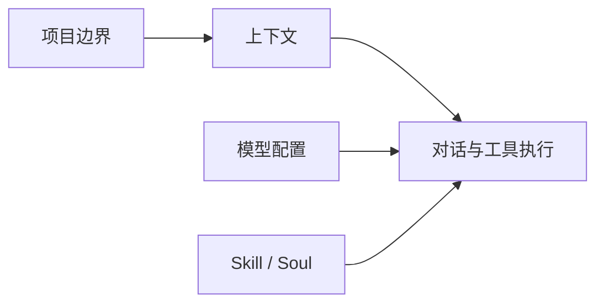

# 从这里开始 · Start Here

这里是 FRIDAY 的使用指南入口。你不需要一次读完，先按当前问题找到对应页面即可。

## 先判断你现在在哪一步

| 你现在的状态 | 建议先看 |
| --- | --- |
| 刚装好插件，不知道下一步做什么 | [[01 快速上手]] |
| 已经能打开工作台，但还不能对话 | [[02 基础配置]] |
| 能对话，但不知道各个按钮做什么 | [[03 工作台怎么用]] |
| 想让 FRIDAY 只处理某个文件夹 | [[04 项目与同步]] |
| 想让 FRIDAY 读当前笔记或文件夹 | [[05 和 FRIDAY 对话]] |
| 想用 `/` 命令处理固定流程 | [[06 Skill 与斜杠命令]] |
| 想调整 FRIDAY 的说话风格 | [[07 Soul 与 FRIDAY 风格]] |
| 想更新这套指南或插件 | [[08 官方内容、订阅与插件更新]] |
| 某个步骤失败了 | [[09 常见问题]] |

## FRIDAY 的三个核心概念

项目边界决定 FRIDAY 能看哪里、写哪里。模型配置决定 FRIDAY 能不能回答。Skill 和 Soul 是在基础能力之上的增强项。

> [!tip]
> 第一次使用不要先追求“全部配置完成”。先选一个工作文件夹，再配好模型，完成第一轮对话即可。

## 这套指南怎么读

如果你是新用户，建议顺序是：

1. [[01 快速上手]]
2. [[02 基础配置]]
3. [[03 工作台怎么用]]
4. [[05 和 FRIDAY 对话]]

如果你已经能对话，可以按需求跳读。比如只关心同步，就直接看 [[04 项目与同步]]；只想了解官方内容刷新，就看 [[08 官方内容、订阅与插件更新]]。

## 官方内容在哪里

官方内容会放在制作组目录下，Start Here 是其中的入门索引。刷新官方内容后，这里的指南和图片资源可以持续更新。
![[assets/00-01.png|420]]

> [!warning]
> Start Here 是完整文档入口，但不是新用户唯一入口。第一次安装插件时，工作台里的引导面板会先带你完成第一公里。
